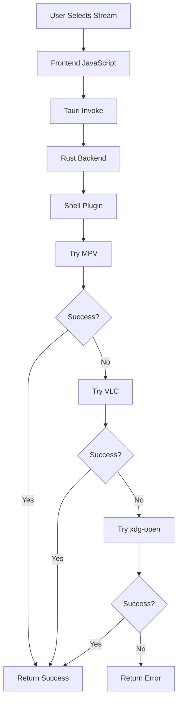

# Phase 4: External Video Player Integration - Development Documentation

## Overview
This phase implemented the ability to launch external video players (mpv, vlc) from the DeckFlix application to handle actual video playback. The integration ensures compatibility with Steam Deck's Linux environment while providing fallback options for different platforms.

## What Was Implemented

### 1. Video Player Command (`src-tauri/src/main.rs`)

**Core Implementation:**
```rust
#[tauri::command]
async fn play_video_external(app: tauri::AppHandle, stream_url: String) -> Result<String, String> {
    // Use Tauri's shell plugin for safe process spawning
    let shell = app.shell();

    // Try different video players in order of preference
    let players = vec!["mpv", "vlc", "xdg-open"];

    for player in players {
        match shell.command(player).arg(&stream_url).spawn() {
            Ok(_) => {
                return Ok(format!("Launched {} with stream", player));
            }
            Err(_) => {
                continue; // Try next player
            }
        }
    }

    Err("No video player found. Please install mpv or vlc.".to_string())
}
```

**Tauri Shell Plugin Integration:**
```rust
// In main.rs setup
tauri::Builder::default()
    .plugin(tauri_plugin_shell::init()) // Enable shell command execution
    .invoke_handler(tauri::generate_handler![
        // ... other commands
        play_video_external,
    ])
```

### 2. Frontend Integration (`src/app.js`)

**Stream Selection and Playback:**
```javascript
async function playStream(stream) {
    try {
        console.log('Playing stream:', stream.url);

        // Show loading feedback to user
        const loadingMsg = document.createElement('div');
        loadingMsg.textContent = 'Launching video player...';
        loadingMsg.style.cssText = `
            position: fixed;
            top: 50%;
            left: 50%;
            transform: translate(-50%, -50%);
            background: var(--bg-secondary);
            padding: 20px;
            border-radius: 8px;
            z-index: 2000;
        `;
        document.body.appendChild(loadingMsg);

        // Call Rust backend to launch player
        const result = await invoke('play_video_external', { streamUrl: stream.url });

        console.log('Player launched:', result);

        // Remove loading message
        document.body.removeChild(loadingMsg);

        // Close modal and return to main view
        closeStreamModal();

    } catch (error) {
        console.error('Failed to play stream:', error);
        alert('Failed to launch video player: ' + error);
    }
}
```

**Stream Quality Detection:**
```javascript
function extractQuality(title) {
    if (!title) return null;

    // Common quality indicators in stream titles
    const qualityPatterns = [
        /4K|2160p/i,    // 4K Ultra HD
        /1080p/i,       // Full HD
        /720p/i,        // HD
        /480p/i,        // SD
        /CAM/i,         // Camera recording
        /TS/i,          // Telesync
        /HDRip/i,       // HD Rip
        /BluRay/i,      // Blu-ray source
        /WEBRip/i       // Web rip
    ];

    for (const pattern of qualityPatterns) {
        const match = title.match(pattern);
        if (match) {
            return `Quality: ${match[0]}`;
        }
    }

    return null;
}
```

### 3. Stream Selection UI

**Stream Item Creation:**
```javascript
function createStreamItem(stream, index) {
    const item = document.createElement('div');
    item.className = 'stream-item focusable';
    item.tabIndex = 0;
    item.dataset.streamIndex = index;

    // Stream title/description
    const title = document.createElement('div');
    title.className = 'stream-title';
    title.textContent = stream.title || stream.name || 'Unknown Stream';

    // Quality information extracted from title
    const quality = document.createElement('div');
    quality.className = 'stream-quality';
    quality.textContent = extractQuality(stream.title) || 'Quality: Unknown';

    item.appendChild(title);
    item.appendChild(quality);

    // Add click listener for playback
    item.addEventListener('click', () => playStream(stream));

    return item;
}
```

**Modal Stream Display:**
```javascript
function displayStreams(streams) {
    // Hide loading spinner
    elements.streamsLoading.classList.add('hidden');

    // Clear existing streams
    elements.streamsList.innerHTML = '';

    // Create stream items
    streams.forEach((stream, index) => {
        const streamItem = createStreamItem(stream, index);
        elements.streamsList.appendChild(streamItem);
    });

    // Show streams list
    elements.streamsList.classList.remove('hidden');

    // Focus first stream for keyboard/controller navigation
    const firstStream = elements.streamsList.querySelector('.stream-item');
    if (firstStream) {
        firstStream.focus();
    }
}
```

### 4. Controller Integration

**A Button Handler for Stream Selection:**
```javascript
// In controller.js
handleAButton(isModalOpen) {
    if (isModalOpen) {
        // In modal, select focused stream
        const focused = document.activeElement;
        if (focused && focused.classList.contains('stream-item')) {
            focused.click(); // Triggers playStream()
        }
    } else {
        // In main view, select focused movie
        if (window.DeckFlixApp.appState.focusedElement) {
            window.DeckFlixApp.appState.focusedElement.click();
        }
    }
}
```

## Challenges Encountered & Solutions

### Challenge 1: Cross-Platform Video Player Support
**Problem**: Different operating systems have different default video players.

**Solution**:
- Implemented fallback chain with multiple player options:
```rust
let players = vec!["mpv", "vlc", "xdg-open"];
```
- `mpv`: Lightweight, preferred for Steam Deck
- `vlc`: Widely available cross-platform
- `xdg-open`: Linux default application launcher

### Challenge 2: Security Restrictions
**Problem**: Web browsers restrict launching external applications for security reasons.

**Solution**:
- Used Tauri's secure shell plugin instead of direct browser APIs
- Rust backend handles process spawning safely
- No direct file system access from JavaScript

### Challenge 3: Stream URL Validation
**Problem**: Stream URLs from addons might be invalid or require special handling.

**Solution**:
- Pass URLs directly to video players (they handle validation)
- Provide clear error messages when playback fails
- Let video players handle various stream formats

### Challenge 4: User Feedback During Launch
**Problem**: Launching external players can take several seconds with no feedback.

**Solution**:
- Implemented loading overlay with clear messaging:
```javascript
const loadingMsg = document.createElement('div');
loadingMsg.textContent = 'Launching video player...';
// Position and style for visibility
```

### Challenge 5: Steam Deck Specific Considerations
**Problem**: Steam Deck runs on Linux and may have specific player preferences.

**Solution**:
- Prioritized `mpv` as first choice (lightweight, efficient)
- Ensured compatibility with Steam Deck's Flatpak environment
- Planned for potential AppImage deployment

### Challenge 6: Error Handling and Recovery
**Problem**: Players might fail to launch or handle certain stream types.

**Solution**:
- Comprehensive error reporting:
```rust
Err("No video player found. Please install mpv or vlc.".to_string())
```
- User-friendly error messages in frontend
- Graceful fallback to alternative streams

## Key Learning Points

### 1. Tauri Shell Plugin Usage
```rust
// Enable shell plugin in Cargo.toml
tauri-plugin-shell = "2.0"

// Initialize in main.rs
.plugin(tauri_plugin_shell::init())

// Use in commands
let shell = app.shell();
shell.command("mpv").arg(&stream_url).spawn()
```

### 2. Process Spawning Best Practices
- Always use Tauri's shell plugin, never direct system calls
- Implement fallback chains for reliability
- Provide meaningful error messages
- Don't wait for process completion (detached launching)

### 3. Video Player Selection Strategy
```rust
// Order by preference: lightweight -> popular -> system default
let players = vec!["mpv", "vlc", "xdg-open"];
```

### 4. Stream URL Handling
- Pass URLs directly to players (they handle protocols)
- No need to validate or modify stream URLs
- Players handle redirects, authentication, etc.

### 5. User Experience Design
- Always provide feedback during async operations
- Clear error messages for troubleshooting
- Graceful degradation when players unavailable

## Video Player Comparison

### MPV
**Pros:**
- Lightweight and fast
- Excellent codec support
- Low resource usage (ideal for Steam Deck)
- Command-line friendly

**Cons:**
- Might not be pre-installed
- Minimal GUI by default

### VLC
**Pros:**
- Widely available
- User-friendly interface
- Extensive format support
- Cross-platform consistency

**Cons:**
- Heavier resource usage
- Slower startup time

### XDG-Open (Linux)
**Pros:**
- Uses system default player
- Always available on Linux
- Respects user preferences

**Cons:**
- Unpredictable behavior
- May not handle all stream types

## Integration Architecture



## Error Handling Flow

```javascript
// Frontend error handling
try {
    const result = await invoke('play_video_external', { streamUrl: stream.url });
    // Success feedback
} catch (error) {
    // User-friendly error display
    alert('Failed to launch video player: ' + error);
}
```

## Future Enhancements

### Potential Improvements
1. **Player Detection**: Check which players are installed
2. **Configuration**: Allow user to set preferred player
3. **Quality Selection**: Automatic quality selection based on bandwidth
4. **Subtitle Support**: Pass subtitle files to players
5. **Resume Playback**: Remember playback position

### Steam Deck Specific
1. **Gaming Mode Integration**: Better integration with Steam UI
2. **Controller Passthrough**: Ensure controller works in video player
3. **Performance Optimization**: CPU/GPU usage monitoring
4. **Battery Optimization**: Power management during playback

## File Structure
```
src-tauri/src/
└── main.rs           # play_video_external command

src/
├── app.js            # playStream function and UI integration
└── controller.js     # Controller support for stream selection
```

## Testing Strategy
- **Manual Testing**: Launch with various stream URLs
- **Player Availability**: Test with/without different players installed
- **Error Scenarios**: Test with invalid URLs, player failures
- **Performance**: Monitor resource usage during playback

This phase successfully implemented a robust video player integration that provides seamless playback on Steam Deck while maintaining compatibility across different platforms and player configurations.